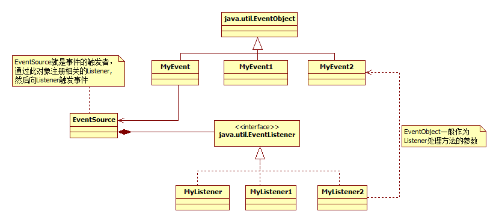

# 事件监听机制

JDK 1.0及更早版本的事件模型基于职责链模式，但是这种模型不适用于复杂的系统，因此在JDK 1.1及以后的各个版本中，事件处理模型采用基于观察者模式的委派事件模型(DelegationEvent Model, DEM)，即一个Java组件所引发的事件并不由引发事件的对象自己来负责处理，而是委派给独立的事件处理对象负责。这并不是说事件模型是基于Observer和Observable的，事件模型与Observer和Observable没有任何关系，Observer和Observable只是观察者模式的一种实现而已。

java中的事件机制的参与者有**3种角色**

- `Event Eource`：事件源，发起事件的主体。
- `Event Object`：事件状态对象，传递的信息载体，就好比Watcher的update方法的参数，可以是事件源本身，一般作为参数存在于listerner 的方法之中。
- `Event Listener`：事件监听器，当它监听到event object产生的时候，它就调用相应的方法，进行处理。

其实还有个东西比较重要：事件环境，在这个环境中，可以添加事件监听器，可以产生事件，可以触发事件监听器。

这个和观察者模式大同小异，但要比观察者模式复杂一些。一些逻辑需要手动实现，比如注册监听器，删除监听器，获取监听器数量等等，这里的eventObject也是你自己实现的。

**实现在项目中。**

