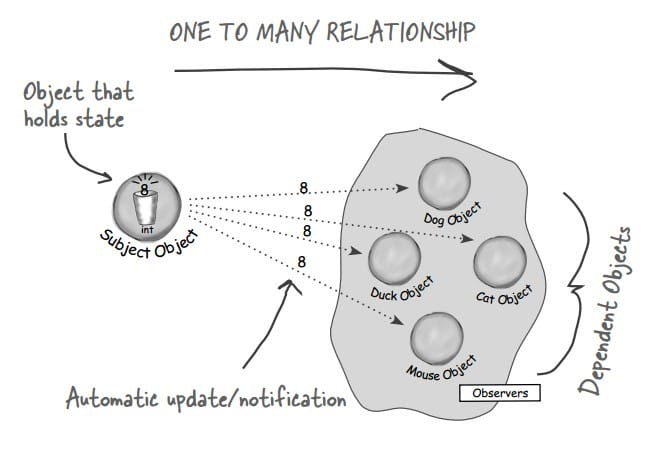
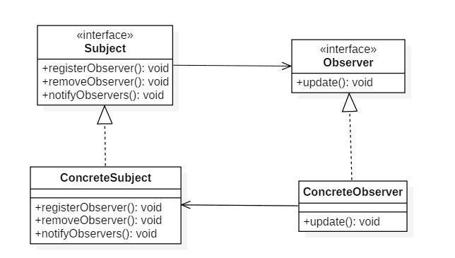
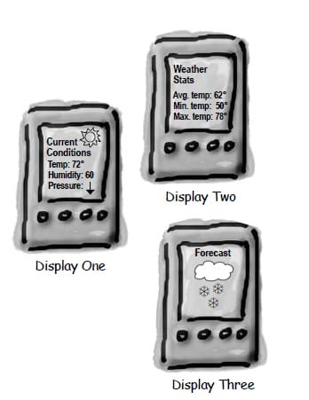

# 行为型 - 观察者(Observer)

> 观察者模式(observer pattern): 在对象之间定义一对多的依赖, 这样一来, 当一个对象改变状态, 依赖它的对象都会收到通知, 并自动更新。@pdai

   

- 行为型 - 观察者(Observer)
  - [意图](https://pdai.tech/md/dev-spec/pattern/19_observer.html#意图)
  - [类图](https://pdai.tech/md/dev-spec/pattern/19_observer.html#类图)
  - [实现](https://pdai.tech/md/dev-spec/pattern/19_observer.html#实现)
  - [JDK](https://pdai.tech/md/dev-spec/pattern/19_observer.html#jdk)

## 意图

定义对象之间的一对多依赖，当一个对象状态改变时，它的所有依赖都会收到通知并且自动更新状态。

主题(Subject)是被观察的对象，而其所有依赖者(Observer)称为观察者。

## 类图

主题(Subject)具有注册和移除观察者、并通知所有观察者的功能，主题是通过维护一张观察者列表来实现这些操作的。

观察者(Observer)的注册功能需要调用主题的 registerObserver() 方法。

## 实现

天气数据布告板会在天气信息发生改变时更新其内容，布告板有多个，并且在将来会继续增加。

代码在项目里。

## JDK

- [java.util.Observer在新窗口打开](http://docs.oracle.com/javase/8/docs/api/java/util/Observer.html)
- [java.util.EventListener在新窗口打开](http://docs.oracle.com/javase/8/docs/api/java/util/EventListener.html)
- [javax.servlet.http.HttpSessionBindingListener在新窗口打开](http://docs.oracle.com/javaee/7/api/javax/servlet/http/HttpSessionBindingListener.html)
- [RxJava](https://github.com/ReactiveX/RxJava)

